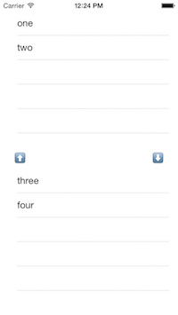

AGToggleFieldSetView
===============

UIView with two UITableView's which allows to toggle rows between them.


##Requirements

* Xcode 5 (or higher)
* Apple LLVM compiler
* ARC
* iOS 6.1 (or higher)

##Installation

Recommended way to install AGToggleFieldSetView is via [CocoaPods](http://cocoapods.org/). Add the following line to your Podfile:

```ruby
pod 'AGToggleFieldSetView'
```

##Usage

To use AGToggleFieldSetView you just need to add UIView to your XIB or Storyboard. Or you can always add it programatically.

```objc
AGToggleFieldSetView *toggleTableView = [[AGToggleFieldSetView alloc] initWirhFrame:CGRectMake(0, 0 , 200, 200)];
[self.view addSubview:toggleTableView];
[toggleTableView setRightItems:@[@"datetime", @"hours", @"name", @"address"]];
```

This component uses  delegate approach to provide content, so you need to implement this one protocol._.h_

```objc
_h_
@interface ExampleViewController : UIViewController <AGToggleFieldSetViewDelegate>

@end

_m_
- (void)fieldDidToggle:(AGToggleFieldSetView*)toggleFieldSet
{
}
```

##Properties

You are always can get the current left and right arrays (or upper and lower arrays) by calling

```objc
[toggleTableView leftItems];
...
[toggleTableView rightItems];
```

To set the orinetation of the UIView you can use: 

```objc
- (void)setToggleTablesOrientation:(AGToggleTablesOrientation)orientation;
```

With option AGToggleTablesVertical



or AGToggleTablesHorizontal


Also, toggle arrows are also have 2 alignment positions

```objc
- (void)setToggleButtonsPosition:(AGToggleButtonsPosition)position;
```

With option AGToggleButtonsPositionOnSides


or AGToggleButtonsPositionCentered


*The UITableViews will be placed equally inside the UIVIew frame. Please keep that in mind.*

All internal controls (like splitter, buttons and tables) are accesable external. So it's fully customizable for you.


##Rows representations

AGToggleFieldSetView supports not only NSString array but also array's of objects. By default, row will be populated with a NSString value, but if it's a complex object - it uses a valueForKey: to show the description of the object.

To set the value to get use: 

```objc
- (void)setDescriptionField:(NSString*)descriptionString;
```

In example:

```objc
[self.toggleTables setLeftItems:@[@{@"text": @"one"}, @"two"]];
[self.toggleTables setRightItems:@[@{@"text": @"three"}, @"four"]];
[self.toggleTables setDescriptionField:@"text"];
```
